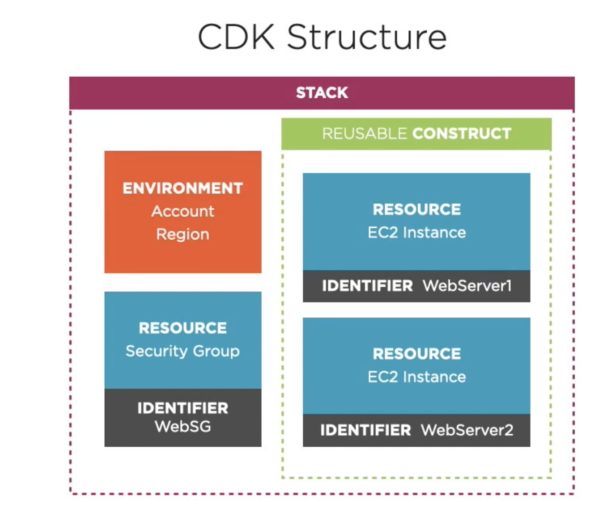

2. Infrastructure as Code
  - Challenges of cloud infrastructure
  - Defining Infrastructure as Code
  - Approaches for defining infrastructure
    - Procedural Approach
    - Declarative Approach
  - Infrastructure as Code on AWS
    - AWS CloudFormation
    - AWS Serverless Application Model (SAM)
    - - Terraform by HashiCorp
    - - Pulumi
    - - Serverless Framework
    - AWS Cloud Development Kit (CDK)
  - Using AWS CloudFormation
    - create and delete wordpressblog
3. Programmatic Infrastructure with the AWS CDK
  - Revisiting the Use Case
  - CDK Overview
  - Structure of a CDK Project
    - Resource and Identifier (Logical ID)
    - Construct is a logical grouping of one or more Resources, are building blocks within the CDK
    - 
    - stack and enviorments
  - CDK Workflow
    - Init
    - Bootstrap
    - Synth
    - Deploy
    - Update
    - Diff
    - Synth
4. Getting Started with the CDK
  - Installing the CDK
    - Node.js npm AWS credentials
    - aws configure
    - npm i aws-cdk -g
    - cdk version